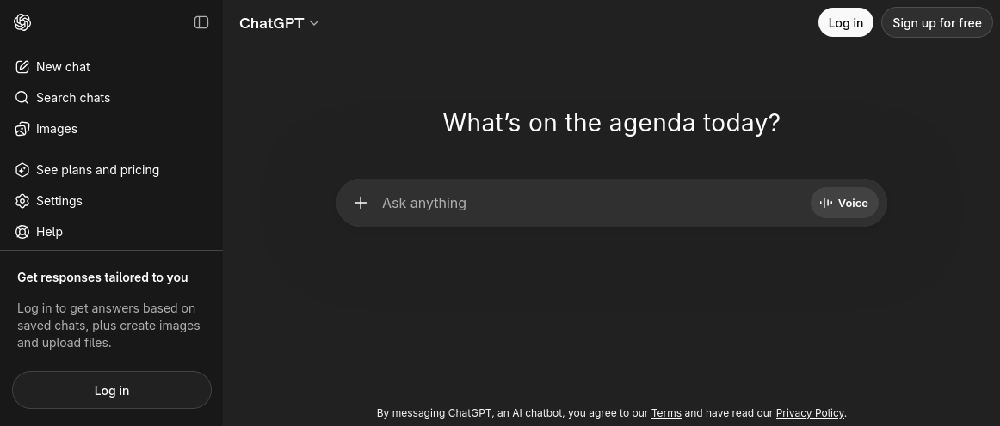
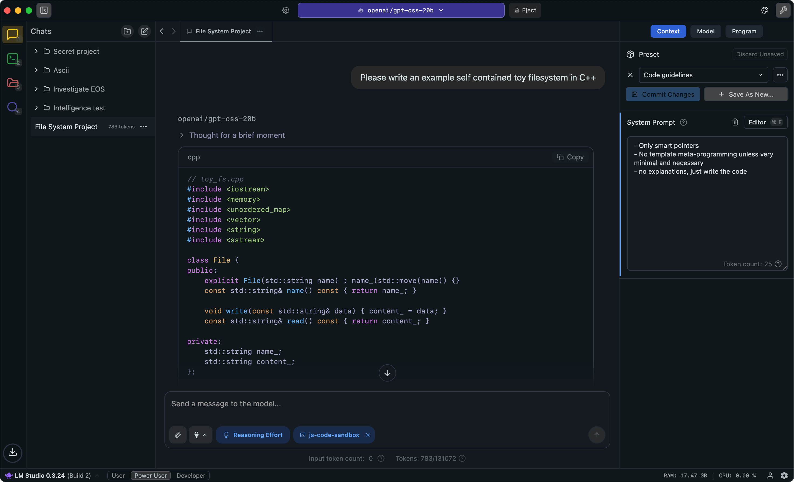
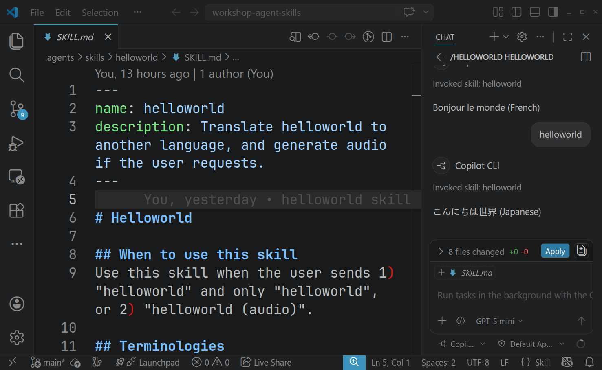

## Build Your First AI Skill


## Agenda

1. LLMs, Agents and Skills
2. Demo: echo helloworld in another language
3. Demo: helloworld and text to speech
4. Build and share your skill


## LLMs You May Have Heard Of

- GPT (OpenAI)
- Claude (Anthropic)
- Llama (Meta AI)
- Gemini (Google)
- Qwen (Alibaba)
- DeepSeek (DeepSeek)


## Using a LLM on the Cloud



Note: a user can send text, images or voice chat with AI; AI can generate text, images and videos;


## Running LLMs Locally



Note: running an open source model locally; conversational; better for privacy, but requires a little bit tech skill to setup, and in many cases a powerful computer is required.


## Agents

- An agent is a tool on your computer that can follow your instructions and work with your files.
- It may be a standalone app, or built into another app.

Note:
1. can write files;
2. can read files;
3. if a file is already in the working context, you usually do not need to send it again after editing;
4. because it is integrated into your tools, you often do not need to switch between apps.


## Common Uses of Agents

- Programmers use agents to write and edit code faster (vibe coding).
- People also use agents as personal AI assistants, for example OpenClaw.

Note:
1. awesome OpenClaw cases;
2. daily Reddit / YouTube digest;
3. custom morning brief;
4. CRM;
5. market research;


## Popular Agents

- Codex (OpenAI)
- Copilot (GitHub)
- Claude Code (Anthropic)
- Gemini (Google)

Note: these agents are not only for programmers


## Preview


Note:
1. revisit the concepts mentioned earlier;
2. an integrated agent can talk to a LLM;
3. has access to local files;
4. an editor widely used by programmers, but can also be useful for non-programming tasks;


## Skills

- A skill is a small instruction file that teaches the AI how to handle one specific task.

Note: a text file in a very simple, easy to understand syntax; once a skill is created, it can be reused; skills are supported by several agent tools.


## Tools

- [VS Code](https://code.visualstudio.com/)
  - Sign in to use Copilot
- (Optional) [Google Antigravity](https://antigravity.google/)
  - Sign in to use Gemini
- (Optional) Codex (ChatGPT Plus) / Claude Code (Claude Pro)

Note:
- when vscode is first installed, it asks to sign in with GitHub / Google / Apple account before talking to AI.
  - first try GitHub account
  - then google / apple (perhaps a github account will be created, pay attention)
- Antigravity requires Google account
- for people with a technical background, other cli agents (claude code / codex / gemini) or editors can also be used.


## Hands-on (part 1)
### Learn the Basics of Markdown

1. Create a new folder on your computer.
2. Open it using VS Code.
3. Create a new file called `helloworld.md`.
4. Visit https://www.markdownguide.org/cheat-sheet/ and try out a few syntaxes.
5. Preview your markdown file in VS Code.

Note: guide people through the interface of VS code;


## Hands-on (part 2)
### Create a Simple Translation Skill

1. Create a new file `.agents/skills/helloworld/SKILL.md` (case sensitive).
2. Add the formatter at the very beginning:
  ```
  ---
  name: my-helloworld
  description: Translate helloworld to another language.
  ---
  ```


## Hands-on (part 2)

3. Put the following content in the markdown body.

  ```
  # Helloworld

  ## When to use this skill
  Use this skill when the user sends "helloworld".

  ## How to Translate
  Return in the format `text (language name)`. The `text` part
  is the text of "helloworld" in another language.

  ## Output Example

  - `你好世界 (Chinese)`
  - `Привет, мир (Russian)`
  ```


## Hands-on (part 3)
### A More Advanced Skill

See this [file](https://github.com/codebar-shanghai/workshop-agent-skills/blob/main/.agents/skills/helloworld/SKILL.md?plain=1)

Note:
1. Explain the skill first;
2. introduce the concept of references and scripts;
3. used on demand, so save tokens (and introduce the concept of context);
4. powerful but should be careful for external scripts which may lead to data leaks;


## Further Reading

- [Agent Skills open standard](https://agentskills.io/home), especially the [specification](https://agentskills.io/specification)
- [Skills from Anthropic](https://github.com/anthropics/skills)
- [Skills from OpenAI](https://github.com/openai/skills)

Note:
- Local skills vs Global skills.
- Skills can cover brand guidelines, canvas design, doc coauthoring, figma desgin generation, frontend design, slides, and spreadsheets.
- There are many open-source skills.
- Since the agents can access your computer as you do, it's better to audit skills written by others first before using.
- When creating your own skill, clear instructions can reduce misunderstanding and lead to better results.
